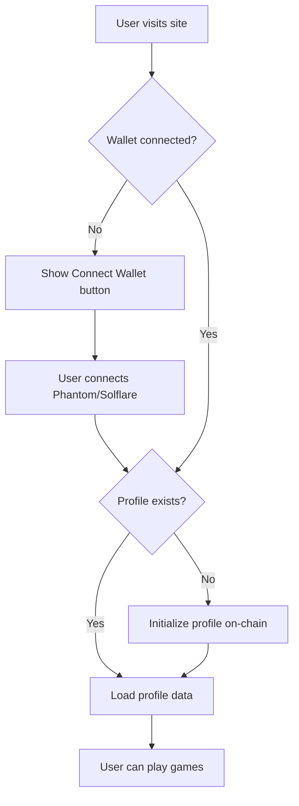
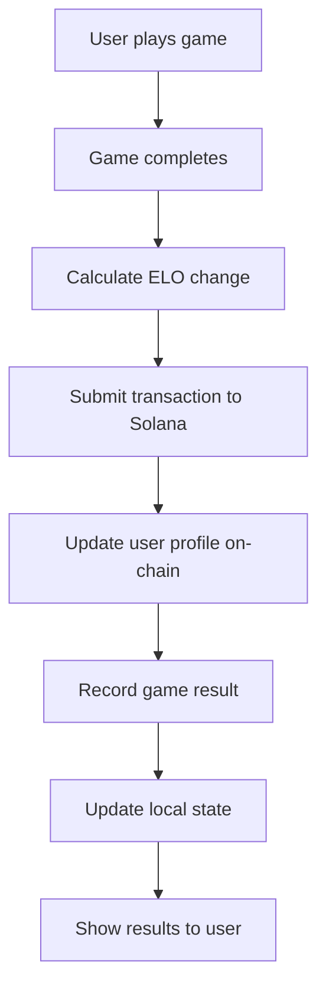
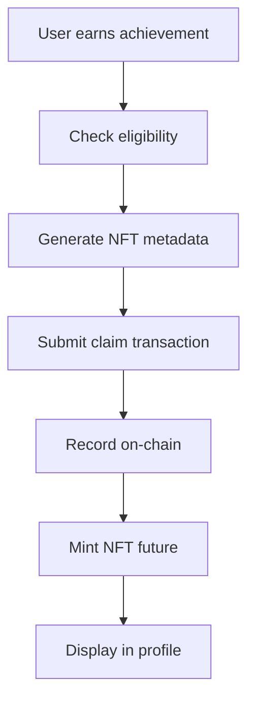

# Blockchain Integration Guide

Complete guide for integrating Solana blockchain into Fluxion v2.

## 🎯 Overview

Fluxion uses Solana blockchain for:
- ✅ **User Profiles**: On-chain identity with ELO and stats
- ✅ **Game Results**: Permanent, verifiable game history
- ✅ **NFT Rewards**: Claimable achievement NFTs
- 🔄 **Wallet Connection**: Phantom, Solflare, Backpack support

## 📋 Components

### 1. Wallet Connection (✅ Implemented)

**Location**: `src/components/wallet/`

```typescript
// WalletProvider.tsx - Wraps app with Solana wallet context
<WalletProvider>
  <App />
</WalletProvider>

// WalletButton.tsx - Connect wallet UI
<WalletButton />
```

**Supported Wallets**:
- Phantom
- Solflare
- Backpack

**Usage**:
```typescript
import { useWalletConnection } from '@/hooks/useWallet';

function MyComponent() {
  const { connected, walletAddress, connectWallet } = useWalletConnection();
  
  if (!connected) {
    return <button onClick={connectWallet}>Connect Wallet</button>;
  }
  
  return <div>Connected: {walletAddress}</div>;
}
```

### 2. Smart Contract (✅ Implemented)

**Location**: `/anchor-program/fluxion_program/`

**Program ID**: `2nGrkskjUEF5pkDgvrdSMsz9f59GX6a6M8rwZAahdTFL`

**Instructions**:
- `initialize_user(username)` - Create user profile
- `update_elo(change, won, game_type)` - Update ELO after game
- `record_game_result(...)` - Store game outcome
- `claim_nft_reward(...)` - Claim achievement NFT

**Build & Deploy**:
```bash
cd /home/mohit/project2/fluxion_v2/anchor-program/fluxion_program

# Build
anchor build

# Test
anchor test

# Deploy to devnet
anchor deploy --provider.cluster devnet
```

### 3. Program Client SDK (✅ Implemented)

**Location**: `src/lib/solana/program.ts`

```typescript
import { FluxionClient, GameType } from '@/lib/solana/program';

// Initialize client
const client = createFluxionClient(connection, wallet);

// Create profile
await client.initializeUser("MyUsername");

// Update ELO
await client.updateElo(30, true, GameType.PredictBattle);

// Record game
await client.recordGameResult(
  GameType.PredictBattle,
  true,
  35,
  "BTC/USD",
  15000
);

// Fetch profile
const profile = await client.getUserProfile();
```

### 4. React Hooks (✅ Implemented)

**Location**: `src/hooks/useProgram.ts`

```typescript
import { useFluxionProgram, useUserProfile } from '@/hooks/useProgram';

function ProfileComponent() {
  const { initializeProfile, updateElo } = useFluxionProgram();
  const { profile, loading } = useUserProfile();
  
  if (loading) return <div>Loading...</div>;
  
  return (
    <div>
      <h1>ELO: {profile?.elo}</h1>
      <p>Wins: {profile?.wins}</p>
    </div>
  );
}
```

## 🔄 Integration Workflow

### 1. User Onboarding



### 2. Game Flow



### 3. Reward Claims



## 🚀 Deployment Checklist

### Before Deploying

- [ ] Build Anchor program: `anchor build`
- [ ] Run all tests: `anchor test`
- [ ] Update program ID in all files
- [ ] Configure RPC endpoint
- [ ] Set up wallet keypair

### Deploy Steps

```bash
# 1. Build program
cd /home/mohit/project2/fluxion_v2/anchor-program/fluxion_program
anchor build

# 2. Deploy to devnet
anchor deploy --provider.cluster devnet

# 3. Copy program ID from output
# Update in:
# - programs/fluxion_program/src/lib.rs (declare_id!)
# - Anchor.toml ([programs.devnet])
# - next-app/.env.local (NEXT_PUBLIC_PROGRAM_ID)

# 4. Rebuild with new ID
anchor build
anchor deploy --provider.cluster devnet

# 5. Copy IDL to frontend
cp target/idl/fluxion_program.json ../next-app/src/lib/solana/
cp target/types/fluxion_program.ts ../next-app/src/lib/solana/
```

### Frontend Configuration

Create `.env.local`:
```bash
# Solana
NEXT_PUBLIC_SOLANA_NETWORK=devnet
NEXT_PUBLIC_PROGRAM_ID=2nGrkskjUEF5pkDgvrdSMsz9f59GX6a6M8rwZAahdTFL
NEXT_PUBLIC_SOLANA_RPC_URL=https://api.devnet.solana.com

# Optional: Use a faster RPC
# NEXT_PUBLIC_SOLANA_RPC_URL=https://solana-devnet.g.alchemy.com/v2/YOUR_KEY
```

## 🧪 Testing

### Smart Contract Tests

```bash
cd /home/mohit/project2/fluxion_v2/anchor-program/fluxion_program
anchor test
```

### Frontend Integration Tests

```typescript
describe('Blockchain Integration', () => {
  it('should connect wallet', async () => {
    // Test wallet connection
  });
  
  it('should initialize user profile', async () => {
    // Test profile creation
  });
  
  it('should update ELO after game', async () => {
    // Test ELO update
  });
});
```

## 🔐 Security Considerations

1. **Wallet Security**
   - Never request private keys
   - Use wallet adapter's signing methods
   - Verify all transactions before signing

2. **Program Security**
   - All accounts use PDAs (Program Derived Addresses)
   - Owner checks on all mutations
   - Input validation on all parameters

3. **Transaction Safety**
   - Show transaction details to user
   - Use preflight checks
   - Handle errors gracefully

4. **RPC Reliability**
   - Use reliable RPC provider (Alchemy, QuickNode)
   - Implement retry logic
   - Cache data when appropriate

## 📊 Cost Estimates (Devnet/Mainnet)

| Operation | Rent Cost | Transaction Fee | Total |
|-----------|-----------|----------------|-------|
| Initialize Profile | ~0.002 SOL | ~0.000005 SOL | ~0.002 SOL |
| Update ELO | 0 SOL | ~0.000005 SOL | ~0.000005 SOL |
| Record Game | ~0.001 SOL | ~0.000005 SOL | ~0.001 SOL |
| Claim NFT | ~0.003 SOL | ~0.000005 SOL | ~0.003 SOL |

> Note: Users pay for their own account rent. Transaction fees are minimal (~$0.00025 at 1 SOL = $50).

## 🛠️ Development Tools

- **Solana Explorer**: https://explorer.solana.com/ (view transactions)
- **Anchor Playground**: https://beta.solpg.io/ (test programs)
- **Phantom Wallet**: https://phantom.app/ (dev wallet)
- **Solana CLI**: Local testing and deployment

## 📚 Next Steps

1. **Phase 1**: ✅ Wallet connection
2. **Phase 2**: ✅ Smart contract deployment
3. **Phase 3**: 🔄 Integrate game results on-chain
4. **Phase 4**: 🔄 Implement NFT minting
5. **Phase 5**: 🔄 Add leaderboard queries
6. **Phase 6**: 🔄 Optimize transaction batching

## 🐛 Troubleshooting

### Wallet won't connect
- Check browser extension is installed
- Verify network is set to devnet
- Try refreshing the page

### Transaction fails
- Check wallet has SOL for fees
- Verify program is deployed
- Check RPC endpoint is responding

### Profile not found
- User may not be initialized yet
- Check program ID matches deployed program
- Verify network configuration

## 📞 Support

For issues or questions:
1. Check logs in browser console
2. Use Solana Explorer to verify transactions
3. Review Anchor program logs
4. Check RPC endpoint status

---

Built for **Solana Hackathon** 🚀

